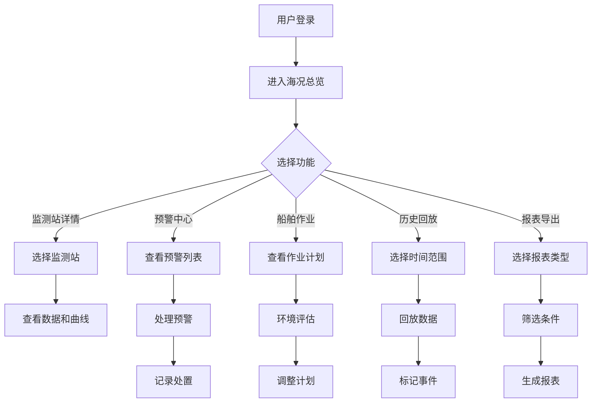
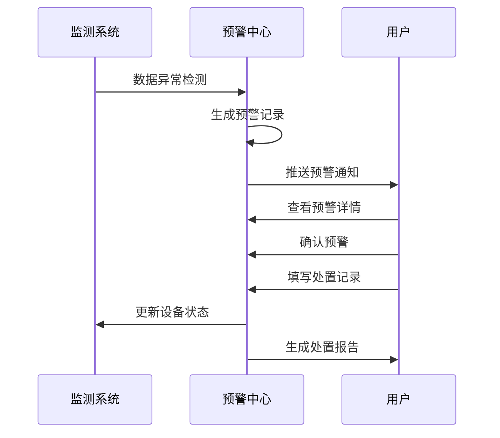

# 智慧海洋环境监测系统 - 产品需求文档

## 1. 产品概述

智慧海洋环境监测系统是一款面向港口管理人员的综合性海洋环境监控平台，旨在实时监测近岸海洋环境参数、智能预警作业风险、科学管理船舶调度、全面回溯历史数据，为港口安全运营提供数据支撑和决策辅助。

本系统解决的核心问题：
- **环境感知不足**：传统方式依赖人工巡检，信息滞后且覆盖范围有限
- **风险预警滞后**：缺乏智能化的阈值监测和预警机制，难以及时发现异常
- **作业调度困难**：无法直观评估环境条件对船舶作业的影响
- **数据追溯繁琐**：历史数据分散，缺乏有效的回放和分析工具

目标用户群体：港口管理人员、海事调度员、环境监测员、安监人员

---

## 2. 核心功能模块

### 2.1 用户角色

| 角色 | 权限范围 | 核心功能 |
|------|---------|---------|
| 港口管理员 | 全部功能 | 系统配置、报表导出、预警处置 |
| 调度员 | 日常监控 | 海况查看、作业管理、预警响应 |
| 监测员 | 数据管理 | 监测站管理、历史回放、事件标记 |

### 2.2 功能架构

本系统包含以下六个核心页面：

1. **海况总览** - 全局海洋环境态势感知
2. **监测站详情** - 单站点深度数据分析和设备状态监控
3. **预警中心** - 告警信息管理和阈值配置
4. **船舶作业** - 码头作业计划与环境关联分析
5. **历史回放** - 时段数据回溯和事件标注
6. **报表导出** - 巡查记录和预警处置报告生成

---

## 3. 页面详细设计

### 3.1 海况总览页面

**核心功能：**
- 实时展示所有监测站的环境参数数据（风速、浪高、潮位、水温、盐度、能见度）
- 监测站分布地图可视化
- 环境参数实时曲线图
- 当前风险等级指示器
- 快速定位异常监测点

**页面布局：**
```
┌─────────────────────────────────────────────────────┐
│ 顶部导航栏：系统名称 + 当前时间 + 用户信息          │
├──────────┬──────────────────────────────────────────┤
│          │                                          │
│ 侧边菜单 │   主内容区域                              │
│ - 总览   │   ┌──────────────────────────────────┐   │
│ - 监测站 │   │ 地图 + 监测站标记点               │   │
│ - 预警   │   └──────────────────────────────────┘   │
│ - 作业   │   ┌──────────────────────────────────┐   │
│ - 回放   │   │ 环境参数仪表盘（6个指标卡片）    │   │
│ - 报表   │   └──────────────────────────────────┘   │
│          │   ┌──────────────────────────────────┐   │
│          │   │ 全局趋势曲线图                   │   │
│          │   └──────────────────────────────────┘   │
│          │                                          │
└──────────┴──────────────────────────────────────────┘
```

**关键指标卡片：**
- 风速：单位 m/s，显示当前值和趋势箭头
- 浪高：单位 m，标注波级
- 潮位：单位 m，显示高潮/低潮状态
- 水温：单位 ℃，标注是否异常
- 盐度：单位 PSU，显示浓度等级
- 能见度：单位 km，标注等级（优/良/差/极差）

### 3.2 监测站详情页面

**核心功能：**
- 单个监测站的详细数据展示
- 实时数据曲线（支持切换不同参数和时间范围）
- 设备状态监控（在线/离线/维护中）
- 监测站基本信息管理
- 历史数据查询
- 设备告警记录

**曲线图表功能：**
- 支持选择时间范围：实时/24小时/7天/30天/自定义
- 支持叠加多个参数曲线
- 支持缩放和平移操作
- 数据点悬停提示详细信息
- 异常区间高亮显示

**设备状态指示：**
- 传感器温度、电压、信号强度
- 校准状态和最后校准时间
- 预计维护时间提醒

### 3.3 预警中心页面

**核心功能：**
- 实时预警信息列表
- 预警等级分类（红色-严重/橙色-警告/黄色-注意/蓝色-提示）
- 预警阈值配置管理
- 预警处置流程跟踪
- 预警规则自定义

**预警类型：**
- 大风预警：风速超过阈值（如 > 15 m/s）
- 低能见度预警：能见度低于阈值（如 < 1 km）
- 异常水质预警：水温或盐度异常
- 设备故障预警：传感器离线或数据异常
- 综合风险预警：多参数联合判断

**预警处置流程：**
```
预警触发 → 自动推送 → 值班人员确认 → 原因分析 → 处置措施 → 记录归档
```

**阈值配置示例：**
| 参数 | 正常范围 | 警告阈值 | 严重阈值 |
|------|---------|---------|---------|
| 风速 | < 10 m/s | 10-15 m/s | > 15 m/s |
| 浪高 | < 1.0 m | 1.0-2.0 m | > 2.0 m |
| 能见度 | > 5 km | 1-5 km | < 1 km |
| 水温 | 10-28 ℃ | 5-10 或 28-32 ℃ | < 5 或 > 32 ℃ |
| 盐度 | 28-35 PSU | 25-28 或 35-38 PSU | < 25 或 > 38 PSU |

### 3.4 船舶作业页面

**核心功能：**
- 码头作业计划列表（日计划/周计划）
- 环境条件对作业影响评估
- 作业窗口时间推荐
- 实时环境参数叠加显示
- 作业进度跟踪

**影响评估模型：**
- 大风影响：影响装卸作业、起重设备操作
- 低能见度影响：限制靠泊、离泊操作
- 异常水质影响：水质监测作业、环境敏感作业
- 综合评估：生成作业建议（适宜/谨慎/暂停）

**作业计划管理：**
- 计划编号、船舶名称、作业类型
- 开始时间、预计结束时间
- 当前状态（待执行/进行中/已完成/已取消）
- 环境达标情况

### 3.5 历史回放页面

**核心功能：**
- 时间范围选择器（自定义起止时间）
- 多参数同步回放
- 数据异常区间标注
- 事件标记和原因记录
- 回放速度控制（1x/2x/4x/8x）

**事件标记功能：**
- 标记类型：设备故障、环境异常、作业影响、人工标注
- 标记描述和建议
- 关联图片上传
- 标记导出功能

**回放控制：**
- 播放/暂停按钮
- 进度条拖拽
- 时间刻度显示
- 数据点快速跳转

### 3.6 报表导出页面

**核心功能：**
- 日常巡查报表生成
- 预警处置记录报表
- 自定义时间范围筛选
- 报表模板选择
- 导出格式支持（PDF/Excel/Word）

**报表类型：**

1. **日常巡查报表**
   - 巡查时间、巡查人员
   - 各监测站数据汇总
   - 异常情况记录
   - 设备运行状态
   - 备注和建议

2. **预警处置报表**
   - 预警时间、内容、等级
   - 响应时间、处置措施
   - 处置人员、处理结果
   - 复盘分析和建议
   - 附件（图片、图表）

3. **综合环境报表**
   - 日/周/月/年统计
   - 参数趋势分析
   - 预警统计汇总
   - 对比分析（同比/环比）

---

## 4. 用户交互流程

### 4.1 主流程图



### 4.2 预警响应流程



---

## 5. 视觉设计规范

### 5.1 设计风格定位

**设计理念：科技蓝 + 海洋韵**

- 主题风格：科技感、海洋元素、数据可视化优先
- 色调方向：深蓝为主，搭配科技感的渐变和发光效果
- 视觉层次：卡片式布局，层次分明，重点突出
- 交互风格：流畅的过渡动画，直观的状态反馈

### 5.2 色彩规范

**主色调：**
```css
--primary-deep: #0a1628;      /* 深蓝背景 */
--primary-main: #1e3a5f;      /* 主蓝色 */
--primary-light: #2d5a87;     /* 浅蓝色 */
--primary-accent: #00d4ff;    /* 科技蓝高亮 */
```

**辅助色：**
```css
--secondary-teal: #0d9488;    /* 青色辅助 */
--secondary-purple: #7c3aed;  /* 紫色点缀 */
```

**状态色：**
```css
--status-normal: #10b981;     /* 正常-绿色 */
--status-warning: #f59e0b;    /* 警告-橙色 */
--status-danger: #ef4444;     /* 严重-红色 */
--status-info: #3b82f6;       /* 提示-蓝色 */
--status-low: #6b7280;        /* 低值-灰色 */
```

**海况等级色：**
```css
--sea-calm: #06b6d4;          /* 平静-青色 */
--sea-moderate: #22c55e;      /* 一般-绿色 */
--sea-rough: #eab308;         /* 较大-黄色 */
--sea-very-rough: #f97316;    /* 大-橙色 */
--sea-extreme: #dc2626;       /* 巨浪-红色 */
```

### 5.3 字体规范

**字体选择：**
- 标题字体：思源黑体（Source Han Sans SC）- 简洁现代
- 正文字体：思源宋体（Source Han Serif SC）- 专业稳重
- 数据字体：DIN Alternate / Roboto Mono - 数字清晰

**字号规范：**
```css
--text-hero: 48px;           /* 超大标题 */
--text-h1: 32px;             /* 页面标题 */
--text-h2: 24px;             /* 模块标题 */
--text-h3: 18px;             /* 卡片标题 */
--text-body: 16px;           /* 正文内容 */
--text-small: 14px;          /* 辅助说明 */
--text-data: 20px;           /* 数据展示 */
--text-label: 12px;          /* 标签文字 */
```

### 5.4 组件规范

**卡片组件：**
- 圆角：12px
- 阴影：`0 4px 20px rgba(0, 212, 255, 0.1)`
- 边框：1px solid rgba(0, 212, 255, 0.2)
- 悬停效果：边框发光增强，微微上浮

**按钮组件：**
- 主按钮：渐变背景（#00d4ff → #0ea5e9），悬停发光
- 次按钮：透明背景 + 边框，悬停填充
- 危险按钮：红色渐变
- 圆角：8px
- 过渡动画：0.3s ease

**数据展示：**
- 仪表盘：圆形进度环 + 中心数字
- 曲线图：平滑曲线 + 渐变填充
- 柱状图：圆角柱子 + 渐变填充
- 地图标记：发光脉冲效果

### 5.5 动画规范

**入场动画：**
- 页面切换：淡入 + 轻微上移，400ms ease-out
- 卡片加载：依次淡入，间隔 100ms
- 数据刷新：数字滚动效果

**交互动画：**
- 按钮悬停：缩放 1.05 + 发光增强
- 卡片悬停：上浮 4px + 阴影加深
- 图表悬停：数据点放大 + 提示框显示

**状态动画：**
- 预警脉冲：红色圆环脉冲动画
- 加载状态：蓝色光点流转
- 成功反馈：绿色对勾弹出

---

## 6. 数据指标定义

### 6.1 环境参数标准

| 参数 | 单位 | 采集频率 | 显示精度 | 正常范围 |
|------|------|---------|---------|---------|
| 风速 | m/s | 1分钟 | 0.1 | 0 - 30 |
| 风向 | ° | 1分钟 | 1 | 0 - 360 |
| 浪高 | m | 5分钟 | 0.1 | 0 - 10 |
| 潮位 | m | 5分钟 | 0.01 | -2 - 8 |
| 水温 | ℃ | 5分钟 | 0.1 | -2 - 35 |
| 盐度 | PSU | 5分钟 | 0.1 | 0 - 50 |
| 能见度 | km | 10分钟 | 0.1 | 0 - 50 |

### 6.2 风险等级定义

| 等级 | 标识 | 影响程度 | 建议操作 |
|------|------|---------|---------|
| 一级 | 蓝色 | 正常 | 常规监控 |
| 二级 | 黄色 | 注意 | 加强巡查 |
| 三级 | 橙色 | 警告 | 限制作业 |
| 四级 | 红色 | 严重 | 停止作业 |

---

## 7. 响应式设计

### 7.1 断点设置

- 桌面端：≥ 1200px（主布局）
- 平板端：768px - 1199px（自适应列数）
- 移动端：< 768px（单列布局，折叠菜单）

### 7.2 适配策略

**桌面端（≥ 1200px）：**
- 左侧固定导航栏（240px宽）
- 主内容区多列布局
- 图表全尺寸展示
- 地图完整交互

**平板端（768px - 1199px）：**
- 可折叠导航栏
- 两列卡片布局
- 图表缩放适配
- 地图简化交互

**移动端（< 768px）：**
- 底部导航栏
- 单列卡片堆叠
- 图表轮播展示
- 地图全屏模式

---

## 8. 性能要求

- 页面首屏加载时间：< 3秒
- 数据刷新延迟：< 1秒
- 图表渲染帧率：≥ 30fps
- 同时在线用户：≥ 100人
- 数据存储周期：≥ 2年

---

## 9. 安全要求

- 用户身份验证（用户名 + 密码）
- 敏感操作日志记录
- 数据传输加密（HTTPS）
- 权限分级控制
- 会话超时自动登出

---

## 10. 成功指标

- 用户满意度：≥ 90%
- 预警响应时间：< 5分钟
- 系统可用性：≥ 99.5%
- 数据准确率：≥ 99%
- 报表导出成功率：≥ 98%
