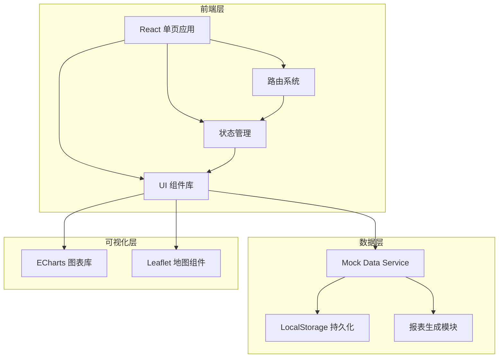
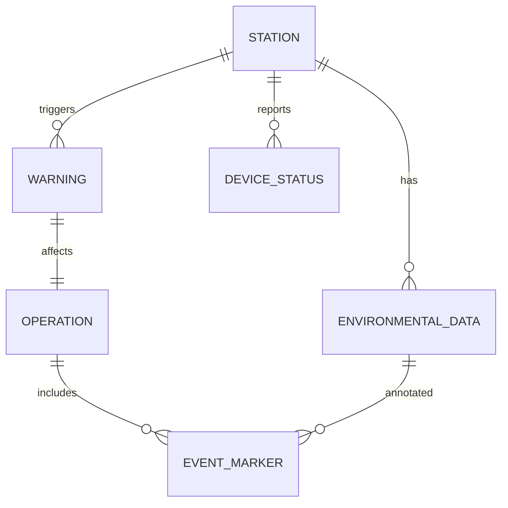

# 智慧海洋环境监测系统 - 技术架构文档

## 1. 架构设计

### 1.1 系统架构图



### 1.2 技术栈选型

**前端框架：**
- React 18：核心框架，组件化开发
- React Router 6：页面路由管理
- Context API + useReducer：轻量级状态管理

**UI 组件库：**
- Tailwind CSS：原子化 CSS 框架
- Lucide React：图标库
- 自定义组件：贴合海洋主题的设计组件

**数据可视化：**
- ECharts 5：折线图、柱状图、仪表盘、散点图
- Leaflet：地图可视化

**工具库：**
- date-fns：日期时间处理
- jsPDF + html2canvas：报表导出
- recharts：轻量级图表（备选）

---

## 2. 项目结构

```
smart-ocean/
├── public/
│   └── index.html
├── src/
│   ├── components/           # 通用组件
│   │   ├── Layout/
│   │   │   ├── Sidebar.jsx   # 侧边导航栏
│   │   │   ├── Header.jsx    # 顶部导航栏
│   │   │   └── Layout.jsx    # 布局容器
│   │   ├── Charts/
│   │   │   ├── LineChart.jsx     # 折线图组件
│   │   │   ├── GaugeChart.jsx    # 仪表盘组件
│   │   │   ├── BarChart.jsx      # 柱状图组件
│   │   │   └── RadarChart.jsx    # 雷达图组件
│   │   ├── Cards/
│   │   │   ├── StatCard.jsx      # 统计卡片
│   │   │   ├── WarningCard.jsx   # 预警卡片
│   │   │   └── StationCard.jsx   # 监测站卡片
│   │   └── Common/
│   │       ├── Button.jsx
│   │       ├── Modal.jsx
│   │       ├── Table.jsx
│   │       └── DatePicker.jsx
│   ├── pages/                # 页面组件
│   │   ├── Dashboard/        # 海况总览
│   │   │   ├── Dashboard.jsx
│   │   │   ├── MapView.jsx
│   │   │   └── StatsOverview.jsx
│   │   ├── StationDetail/    # 监测站详情
│   │   │   ├── StationDetail.jsx
│   │   │   ├── DataChart.jsx
│   │   │   └── DeviceStatus.jsx
│   │   ├── WarningCenter/    # 预警中心
│   │   │   ├── WarningCenter.jsx
│   │   │   ├── WarningList.jsx
│   │   │   └── ThresholdConfig.jsx
│   │   ├── ShipOperation/    # 船舶作业
│   │   │   ├── ShipOperation.jsx
│   │   │   ├── OperationPlan.jsx
│   │   │   └── ImpactAssessment.jsx
│   │   ├── HistoryPlayback/  # 历史回放
│   │   │   ├── HistoryPlayback.jsx
│   │   │   ├── TimeSlider.jsx
│   │   │   └── EventMarker.jsx
│   │   └── ReportExport/      # 报表导出
│   │       ├── ReportExport.jsx
│   │       ├── ReportPreview.jsx
│   │       └── ExportConfig.jsx
│   ├── services/             # 数据服务
│   │   ├── mockData.js       # 模拟数据生成
│   │   ├── dataService.js    # 数据查询服务
│   │   └── exportService.js  # 报表导出服务
│   ├── context/             # React Context
│   │   ├── AppContext.jsx   # 全局状态
│   │   └── WarningContext.jsx # 预警状态
│   ├── hooks/                # 自定义 Hooks
│   │   ├── use海洋数据.js
│   │   ├── use预警.js
│   │   └── use报表.js
│   ├── utils/               # 工具函数
│   │   ├── dateUtils.js
│   │   ├── formatUtils.js
│   │   └── chartUtils.js
│   ├── styles/              # 全局样式
│   │   └── globals.css
│   ├── App.jsx              # 根组件
│   └── main.jsx             # 入口文件
├── package.json
├── vite.config.js
├── tailwind.config.js
└── postcss.config.js
```

---

## 3. 路由设计

### 3.1 路由定义

| 路由路径 | 页面名称 | 组件 | 功能描述 |
|---------|---------|------|---------|
| / | 首页/海况总览 | Dashboard | 海洋环境总览和数据展示 |
| /station/:id | 监测站详情 | StationDetail | 单个监测站深度分析 |
| /warnings | 预警中心 | WarningCenter | 预警管理和阈值配置 |
| /operations | 船舶作业 | ShipOperation | 作业计划和影响评估 |
| /playback | 历史回放 | HistoryPlayback | 数据回放和事件标注 |
| /reports | 报表导出 | ReportExport | 报表生成和导出 |

### 3.2 路由守卫

- 未登录用户访问需重定向到首页
- 管理员专属页面需权限验证
- 404 页面友好提示

---

## 4. 数据模型

### 4.1 数据实体

**监测站（Station）：**
```typescript
interface Station {
  id: string;
  name: string;
  location: {
    lat: number;
    lng: number;
  };
  type: 'buoy' | 'fixed' | 'mobile';
  status: 'online' | 'offline' | 'maintenance';
  installedDate: string;
  sensors: string[];
}
```

**环境数据（EnvironmentalData）：**
```typescript
interface EnvironmentalData {
  stationId: string;
  timestamp: string;
  windSpeed: number;      // m/s
  windDirection: number;  // °
  waveHeight: number;     // m
  tideLevel: number;      // m
  waterTemp: number;      // ℃
  salinity: number;       // PSU
  visibility: number;      // km
}
```

**预警记录（Warning）：**
```typescript
interface Warning {
  id: string;
  stationId: string;
  type: 'wind' | 'visibility' | 'water' | 'device';
  level: 'info' | 'warning' | 'danger' | 'critical';
  message: string;
  value: number;
  threshold: number;
  timestamp: string;
  status: 'pending' | 'confirmed' | 'resolved';
  handler?: string;
  handleTime?: string;
  remark?: string;
}
```

**作业计划（Operation）：**
```typescript
interface Operation {
  id: string;
  shipName: string;
  berth: string;
  type: 'loading' | 'unloading' | 'bunkering' | 'maintenance';
  startTime: string;
  endTime: string;
  status: 'scheduled' | 'in_progress' | 'completed' | 'cancelled';
  environmentAssessment: {
    windRisk: 'low' | 'medium' | 'high';
    visibilityRisk: 'low' | 'medium' | 'high';
    waterRisk: 'low' | 'medium' | 'high';
  };
}
```

**事件标记（EventMarker）：**
```typescript
interface EventMarker {
  id: string;
  timestamp: string;
  type: 'device_fault' | 'environment_anomaly' | 'operation_impact' | 'manual';
  description: string;
  severity: 'low' | 'medium' | 'high';
  attachments?: string[];
  stationId?: string;
}
```

### 4.2 数据关系图



---

## 5. Mock 数据服务

### 5.1 数据生成策略

**时间序列数据：**
- 模拟 6 个监测站的实时数据
- 每分钟更新一次风速、风向
- 每 5 分钟更新浪高、潮位、水温、盐度
- 每 10 分钟更新能见度
- 包含随机波动和异常值模拟

**预警数据：**
- 预设阈值规则
- 自动生成符合规则的预警
- 支持手动触发测试预警

**作业计划数据：**
- 预设 3-5 个活跃作业计划
- 包含不同状态和类型
- 关联环境评估结果

### 5.2 数据持久化

- LocalStorage 存储用户设置
- SessionStorage 存储临时状态
- IndexedDB 存储大量历史数据（备选）

---

## 6. 组件库设计

### 6.1 通用组件

**Layout 组件：**
- Sidebar：侧边导航栏，支持折叠
- Header：顶部状态栏，显示时间、用户、通知
- Layout：统一布局容器

**Chart 组件：**
- LineChart：支持多曲线、时间轴、缩放
- GaugeChart：仪表盘，展示单个指标
- BarChart：柱状图，参数对比
- RadarChart：雷达图，多维度评估

**Card 组件：**
- StatCard：数据统计卡片，支持趋势指示
- WarningCard：预警信息卡片，支持状态切换
- StationCard：监测站信息卡片，支持快捷操作

**Form 组件：**
- Button：按钮，支持多种样式和状态
- Modal：模态框，支持自定义内容
- Table：数据表格，支持排序和分页
- DatePicker：日期选择器，支持范围选择

### 6.2 页面级组件

每个页面包含 3-5 个核心组件：
- 主容器组件
- 数据展示组件
- 交互控制组件
- 辅助信息组件

---

## 7. 状态管理

### 7.1 全局状态（AppContext）

```typescript
{
  user: {
    id: string;
    name: string;
    role: string;
  },
  theme: 'dark' | 'light',
  sidebarCollapsed: boolean,
  currentStation: string | null,
  timeRange: {
    start: string;
    end: string;
  }
}
```

### 7.2 预警状态（WarningContext）

```typescript
{
  warnings: Warning[],
  unreadCount: number,
  thresholds: Threshold[],
  filters: {
    level: string[];
    type: string[];
    status: string[];
  }
}
```

---

## 8. 性能优化策略

### 8.1 代码层面

- React.memo 缓存组件
- useMemo 缓存计算结果
- useCallback 缓存回调函数
- 虚拟列表优化长列表渲染
- 防抖和节流优化频繁操作

### 8.2 数据层面

- 数据分页和懒加载
- 增量更新而非全量刷新
- 数据缓存策略
- 离线数据支持

### 8.3 资源层面

- 图片懒加载
- 动态导入组件
- Tree-shaking 优化包体积
- Gzip 压缩

---

## 9. 浏览器兼容性

| 浏览器 | 最低版本 | 推荐版本 |
|--------|---------|---------|
| Chrome | 90+ | 最新版 |
| Firefox | 88+ | 最新版 |
| Safari | 14+ | 最新版 |
| Edge | 90+ | 最新版 |
| IE | 不支持 | - |

---

## 10. 开发规范

### 10.1 代码规范

- 使用 ESLint + Prettier
- React Hooks 规范
- 组件命名规范（大写开头）
- 文件组织规范（按功能模块）

### 10.2 Git 规范

- 分支命名：feature/xxx, bugfix/xxx
- Commit 规范：feat/fix/docs/style/refactor/test/chore
- PR 要求：至少 1 人 review

### 10.3 文档规范

- JSDoc 注释组件和函数
- README.md 说明项目结构
- 接口文档维护

---

## 11. 部署方案

### 11.1 构建产物

- HTML + CSS + JS 静态文件
- 支持任意 Web 服务器部署
- Nginx 配置示例提供

### 11.2 环境配置

- Development：本地开发
- Production：生产环境
- 环境变量配置分离

---

## 12. 扩展性考虑

### 12.1 未来功能扩展

- 实时 WebSocket 推送
- 多语言支持（i18n）
- 深色/浅色主题切换
- PWA 支持（离线访问）
- 移动端 App 扩展

### 12.2 数据源扩展

- 对接真实 API 接口
- 支持多种数据库
- 数据导入导出功能
- 第三方数据接入

---

## 13. 关键实现细节

### 13.1 地图实现

- 使用 Leaflet + React-Leaflet
- 自定义标记点样式
- 弹窗信息展示
- 监测站快速切换

### 13.2 图表实现

- ECharts 配置封装
- 响应式图表适配
- 图表主题定制
- 数据动画效果

### 13.3 报表导出实现

- jsPDF 生成 PDF
- html2canvas 截图
- Excel 导出（SheetJS）
- 模板引擎支持

### 13.4 实时数据模拟

- setInterval 定时更新
- 数据波动算法
- 异常数据注入
- 性能影响控制

---

## 14. 测试策略

### 14.1 单元测试

- Jest + React Testing Library
- 组件测试覆盖
- 工具函数测试

### 14.2 集成测试

- 页面功能测试
- 路由跳转测试
- 状态管理测试

### 14.3 E2E 测试（备选）

- Playwright 自动化测试
- 关键流程覆盖

---

## 15. 监控和日志

### 15.1 前端监控

- 错误边界捕获
- 性能监控（Web Vitals）
- 用户行为埋点（备选）

### 15.2 日志记录

- Console 日志分级
- 错误日志收集
- 操作日志记录

---

**文档版本：** v1.0  
**创建日期：** 2026-06-14  
**最后更新：** 2026-06-14
